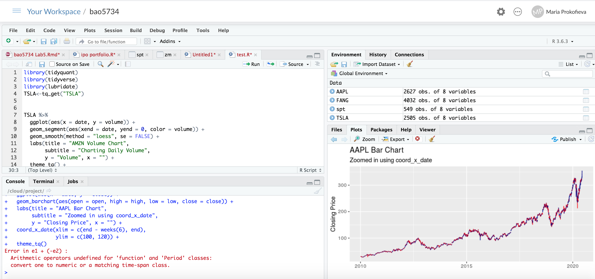
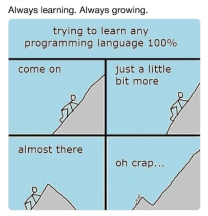

```{r setup, include=FALSE}
options(htmltools.dir.version = FALSE)
```
#Why R?

- it's free!
- it has lots of packages
- focus on data analysis
- graphics and charting
- support and community
- it's growing fast!

---

#Let's get started!

To start straight away: [RSudio Cloud](https://rstudio.cloud/)

For a desktop version:
1. Install [R](https://cran.rstudio.com/)
2. Install [Rstudio](https://rstudio.com/products/rstudio/download/)

.center[]

---
#At times...

.center[]

---
# Resoures

## Books
- [R for data science](https://r4ds.had.co.nz/) 
- [Advanced R](https://adv-r.hadley.nz/)
- [ggplot2: Elegant Graphics for Data Analysis](https://ggplot2-book.org/)
- [RMarkdown](https://rmarkdown.rstudio.com/lesson-1.html)

## Community 
- [Twitter](https://twitter.com/search?q=rstats&src=typed_query)
- [Stackoverflow](https://stackoverflow.com/)

## Meetups
- [RLadies Melbourne](https://www.meetup.com/rladies-melbourne/)
- [Data Science Melbourne](https://www.meetup.com/Data-Science-Melbourne/)

---
class: inverse, center, middle
# Get Started

.center[]

---

# Hello World

To install a package:

```{r eval=FALSE, tidy=FALSE}
install.packages("packageName")
```

To use a package:

```{r eval=FALSE, tidy=TRUE}
library("packageName")
```

[CRAN (The Comprehensive R Archive Network)](https://cran.r-project.org/)

Some useful packages:

- [ggplot2](https://ggplot2.tidyverse.org/)
- [tidyverse](https://tidyverse.org/)
- [tidymodels](https://www.tidymodels.org/)

---

background-image: url("images/w1.jpg")
background-position: 50% 50%
class: center, bottom, inverse

# Let's code away!

---

#So how do I start!

- Create a new R script document from the menu `File -> New File -> R Script`;<sup>1</sup>

- Create a new RMarkdown document from the menu `File -> New File -> RMarkdown`;<sup>1</sup>

---


# Let's load some files


